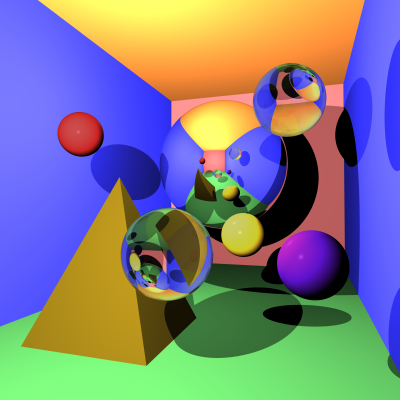
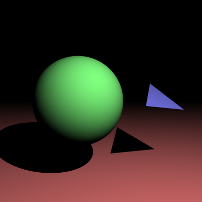
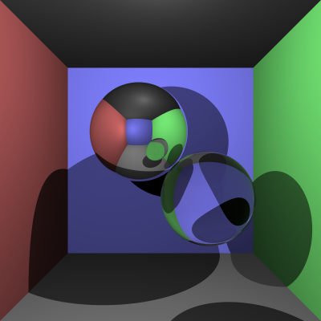
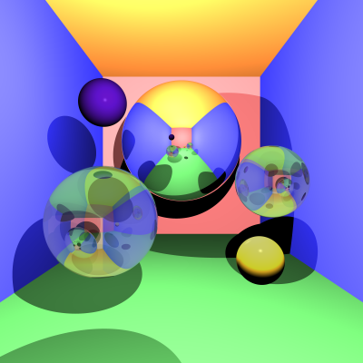

# Ray Tracer Implementation

## Extra Effects

#### Glossy Materials

For Glossy materials, I used the code for diffuse materials as a starting point and also added in the reflection part. I then read through Scratchapixel (The Phong Model Introduction) and 1000 Forms of Bunnies (Reflecting Materials) to better understand the diffuse and reflective implementations in Glossy materials and modified my code accordingly. As for the proportions of color from the diffuse element (kd) and the specular element (ks = 1 - kd), I just played around with the values and ended up choosing ks = 0.2 as it provided the best and most noticeable gloss on the outputs.

#### Custom Camera Orientation

For the custom camera orientation, I first tried playing around with the origin and the initial origin direction in the Render function. After getting no where, I found the Gabriel Gambetta's website and read the first section on camera positioning. I found out that a 'Canvas to Viewport' / 'Image to World' function was needed. I researched a bit more and found some code on Scratchapixel (Generating Camera Rays) and implemented it. I found out about how to transform 3D Vectors for the origin's initial direction (0,0,1) using rotation matrices from Wikipedia. I later found out from the discussion board we had to use the left-handed coordinate system, so I modified the rotation matrices from Wikipedia accordingly to the Butterfly of Dream website.


## Final Scene Render

In my final scene, I implement Glossy materials onto the red, yellow, and purple spheres, and I positioned the camera to the right of the room at (1,0,0) while turning 20 degrees anti-clockwise (left-handed coordinate system) on the axis (0.15,1.-0.5).



This render took 13 minutes and 48 seconds on my PC.

I used the following command to render the image exactly as shown:

```
dotnet run -- -f tests/final_scene.txt -o final_scene.png --cam-pos 1,0,0 --cam-axis 0.15,1,-0.5 --cam-angle 20 -x 16
```

## Other Outputs

### Sample Scenes 1 and 2
Here are my output codes and images for replicating sample scenes 1 and 2 with x16 anti-aliasing:
```
dotnet run -- -f tests/sample_scene_1.txt -o stage_2_sample_scene_1.png -x 16
dotnet run -- -f tests/sample_scene_2.txt -o stage_2_sample_scene_2.png -x 16 
```
<p float="left">
  
   
</p>

### Glossy Materials
Here was the image I was satified with after implementing Glossy materials. The purple and yellow spheres were of Glossy material. NOTE: I used a old version of final_scene.txt for this image so running the code below won't achieve the same results as shown.
```
dotnet run -- -f tests/final_scene.txt -o glossy_scene.png -x 16
```
<p float="left">
  
</p>

## References

Here are the references that I have used to implement into my code.

1000 Forms of Bunnies: Ray Tracing - Camera and Multisampling Antialiasing: http://viclw17.github.io/2018/07/17/raytracing-camera-and-msaa/

1000 Forms of Bunnies: Ray Tracing - Diffuse Materials: http://viclw17.github.io/2018/07/20/raytracing-diffuse-materials/

1000 Forms of Bunnies: Ray Tracing - Ray Sphere Intersection: http://viclw17.github.io/2018/07/16/raytracing-ray-sphere-intersection/

1000 Forms of Bunnies: Ray Tracing - Reflecting Materials: http://viclw17.github.io/2018/07/30/raytracing-reflecting-materials/

Butterfly of Dream: Converting Rotation Matrices of Left-Handed Coordinate System: https://butterflyofdream.wordpress.com/2016/07/05/converting-rotation-matrices-of-left-handed-coordinate-system/

Dr Jarrod Knibbe (University of Melbourne, 2021 Sem 2): Graphics and Interaction: Week 2b: Rasterising and Ray Tracing Lecture

Gabriel Gambetta: Extending the Raytracer: https://gabrielgambetta.com/computer-graphics-from-scratch/05-extending-the-raytracer.html

Kemptm GitHub: Ray Tracer: https://github.com/kemptm/RayTracer

Kyle Halladay: Ray-Sphere Intersection with Simple Math: http://kylehalladay.com/blog/tutorial/math/2013/12/24/Ray-Sphere-Intersection.html

Scratchapixel: A Minimal Ray-Tracer: Rendering Simple Shapes (Sphere, Cube, Disk, Plane, etc.): https://www.scratchapixel.com/lessons/3d-basic-rendering/minimal-ray-tracer-rendering-simple-shapes

Scratchapixel : An Overview of the Ray-Tracing Rendering Technique: https://www.scratchapixel.com/lessons/3d-basic-rendering/ray-tracing-overview/light-transport-ray-tracing-whitted

Scratchapixel: Introduction to Ray Tracing: a Simple Method for Creating 3D Images: https://www.scratchapixel.com/lessons/3d-basic-rendering/introduction-to-ray-tracing/

Scratchapixel: Introduction to Shading: https://www.scratchapixel.com/lessons/3d-basic-rendering/introduction-to-shading/

Scratchapixel: Placing a Camera: the LookAt Function: https://www.scratchapixel.com/lessons/mathematics-physics-for-computer-graphics/lookat-function/framing-lookat-function

Scratchapixel: The Phong Model Introduction to the Concepts of Shader, Reflection Models, and BRDF: https://www.scratchapixel.com/lessons/3d-basic-rendering/

Scratchapixel: Rasterization: a Practical Implementation: https://www.scratchapixel.com/lessons/3d-basic-rendering/rasterization-practical-implementation

Scratchapixel: Ray Tracing: Generating Camera Rays: https://www.scratchapixel.com/lessons/3d-basic-rendering/ray-tracing-generating-camera-rays

Scratchapixel: Ray Tracing: Rendering a Triangle: https://www.scratchapixel.com/lessons/3d-basic-rendering/ray-tracing-rendering-a-triangle

Stack Overflow: How to move a camera using in a ray-tracer?: https://stackoverflow.com/questions/13078243/how-to-move-a-camera-using-in-a-ray-tracer

Tom's Hardware: Anti-Aliasing Analysis, Part 1: Settings and Surprises: https://www.tomshardware.com/reviews/anti-aliasing-nvidia-geforce-amd-radeon,2868-2.html

Totologic: Accurate Point in Triangle Test: https://totologic.blogspot.com/2014/01/accurate-point-in-triangle-test.html

Wikipedia: Rotation Matrix: https://en.wikipedia.org/wiki/Rotation_matrix
